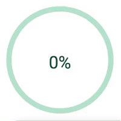

# CircleGauge

## Preview

## Usage 

html
```html
<script src="path/to/circleGauge.js"></script>
<div id = 'target'></div>
```
javascript
```javascript
var target = document.getElementById('target');
var circleGauge = new CircleGauge().create(target);
```
requireJS
```javascript
require(['path/to/circleGauge.js'], function (Gauge) {
	var target = document.getElementById('test');
	var circleGauge = new Gauge().create(target);
});
```

## Examples
[CircleGauge Examples](https://yeonjuan.github.io/ygui/circlegauge.html)
## Docs
[CircleGauge API docs](./DOC.md)

