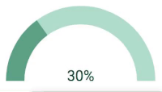

# HalfCircleGauge

## Preview

## Usage

html
```html
<script src="path/to/halfCircleGauge.js"></script>

<div id = 'target'></div>
```
javascript
```javascript
var target = document.getElementById('target');
var halfCircleGauge = new HalfCircleGauge().create(target);
```

requireJS 
```javascript
require(['path/to/circleGauge.js'], function (Gauge) {
	var target = document.getElementById('test');
	var circleGauge = new Gauge().create(target);
});
```
## Docs
[HalfCircleGauge API docs](https://github.com/yeonjuan/wever-UI/wiki/HalfCircleGauge)

