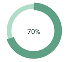

# ygUI. 
Javascript UI Components

| *Circle Gauge* | *Half Circle Gauge* |
| :------------- | :------------- |
|  |  |
|[code](./CircleGauge)   [examples](https://yeonjuan.github.io/ygui/circlegauge.html) |[code](./HalfCircleGauge)   [examples]() |

## to-do.  
- [x] circular percentage bar
- [ ] loading spinner
- [ ] loading bar
- [ ] timer
- [ ] clock
- [ ] bar chart
- [ ] pie chart
- [ ] date picker
- [ ] time picker
- [ ] color picker

