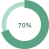
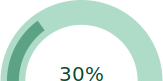
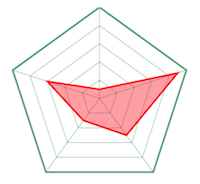

# wever-UI.
Javascript UI Components
| *Circle Gauge* | *Half Circle Gauge* |  *~~Radar Chart~~* |
| :------------- | :------------- | :------------- |
|  |  |  |
|[code](./CircleGauge)   [examples](https://yeonjuan.github.io/ygui/circlegauge.html) |[code](./HalfCircleGauge)   [examples](https://yeonjuan.github.io/ygui/halfCircleGauge.html) | [code](./RadarChart)   [examples]() |

## to-do.
- [x] Circle Gauge
- [x] Half Circle Gauge
- [x] Vertical Progress Bar
- [x] Horizontal Progress Bar
- [ ] Radal Chart (진행중)
- [ ] Loading Spin
- [ ] Timer
- [ ] Digital Clock
- [ ] Bar Chart
- [ ] Pie Chart
- [ ] Date Picker
- [ ] Time Picker
- [ ] Color Picker
- [ ] Pagination

